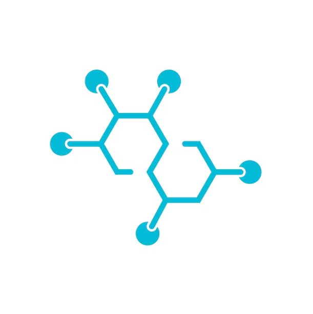

<div align="center">
    
</div>

# **Challenge : Molecular Property Prediction**

___
*Matthieu Kaeppelin (M2DS)*

*Bastien Lecomte (M2DS)*

*Antoine Verier (M2DS)*

*Thomas Vujasinovic (M2DS)*

*Kam Osiris Yetna (M2DS)*
___
# Introduction


- The data for this challenge comes from a subset of the MoleculeNet dataset, a globally recognized benchmark for evaluating machine learning algorithms in chemistry.

- More specifically, this challenge is based on the `molvision/BACE-V-SMILES-0` dataset. It contains SMILES representations (*Simplified Molecular-Input Line-Entry System*) of a large set of chemical compounds, which have been experimentally tested in vitro to assess their ability to inhibit the Beta-secretase 1 enzyme (BACE-1).

### **What is the objective of the task ?** 

Your mission is to design a robust binary classification model. Your algorithm will take the SMILES string of a molecule as input and predict its efficacy as a BACE-1 inhibitor by assigning it a label:

- Label = 1: The molecule is an active inhibitor of BACE-1.

- Label = 0: The molecule is inactive.

### **Why does it matters ?**

The enzyme BACE-1 plays a central role in the formation of amyloid plaques in the brain, one of the main pathological characteristics of Alzheimer's disease. It is therefore a major therapeutic target.
However, developing a new drug is an extremely cumbersome process. Physically testing millions of chemical compounds in the laboratory is an impossible approach on a large scale.

This is where machine learning becomes crucial. Being able to predict the activity of these inhibitors computationally (in silico) makes it possible to quickly filter candidate molecules, drastically reduce clinical failures, and accelerate the discovery of new treatments.

### **Out-of-distribution test set**

This is not a standard random-split challenge. The dataset has been strictly split based on Molecular Weight (MW):

- Train set: it contains smaller molecules (MW < 592 Da).

- Hidden test set: it contains exclusively larger molecules (MW ≥ 592 Da).

Your model must prove it has learned true chemical rules to extrapolate to uncharted chemical space, rather than just memorizing the training statistics! 

***NB** : You are not allowed to use the molecules of the hidden test set for training or validation. Any attempt to do so will lead to disqualification.*

### **First steps to help you get started:**

To manipulate the chemical data in the challenge, we strongly recommend using RDKit, the leading Python library for chemoinformatics. Its `Chem` module will allow you to easily convert SMILES text strings into more manageable molecular objects, then generate numerical descriptors (such as Morgan Fingerprints) that can be directly used by your machine learning models. RDKit is a powerful tool that will greatly facilitate your task of extracting the relevant characteristics of your molecules and climbing to the top of the rankings! 

RDKit documentation: https://www.rdkit.org/docs/GettingStartedInPython.html


# Evaluation metric
Submissions are evaluated using **Cohen’s Kappa** score. This metric is robust to class imbalance and accounts for agreement occurring by chance, which makes it more appropriate than raw accuracy for this dataset.

# Baseline model
A baseline is provided in the notebook using:

- **Morgan fingerprints** (ECFP-like) from RDKit
- **Random forest** classifier

This baseline converts SMILES to fixed-length fingerprints, then trains a Random Forest to predict labels. The socre is approximately 0.31, TRY TO BEAT IT!

# Submission format

Your submission file should be `.py` file containging a scikit-learn compatible estimator class with  `fit`, `predict` and `predict_proba` methods. You can find an example implementation in the `solution/submission.py` file.


# Structure of the bundle

- `competition.yaml`: configuration file for the codabench competition,
  specifying phases, tasks, and evaluation metrics.
- `ingestion_program/`: contains the ingestion program that will be run on
  participant's submissions. It is responsible for loading the code from the
  submission, passing the training data to train the model, and generating
  predictions on the test datasets. It contains:
    * `metadata.yaml`: A file describing how to run the ingestion program for
      `codabench`. For a single script ingestion program in `ingestion.py`, no
      need to edit it.
    * `ingestion.py`: A script to run the ingestion. The role of this script is
      to load the submission code and produce predictions that can be evaluated
      with the `scoring_program`.
      In our example, `the submission.py` define a `get_model` function that
      returns a scikit-learn compatible model. This model is then fitted on the
      training data calling `fit`, and the `predict` method is used to generate
      predictions on the test data. These predictions are stored as a csv file,
      to be loaded with the `scoring_program`.
- `scoring_program/`: contains the scoring program that will be run to evaluate
  the predictions generated by the ingestion program. It loads the predictions
  and the ground truth labels, computes the evaluation metric (accuracy in this
  case), and outputs the score. It contains:
    * `metadata.yaml`: A file describing how to run the scoring program for
      `codabench`. For a single script ingestion program in `scoring.py`, no
      need to edit it.
    * `scoring.py`: A script to run the scoring. This script loads the
      prediction dumped from the ingestion program and produce a single json
      file containing the scores associated with the submission.
      In our example, we compute `accuracy` on two test sets (public and
      private) as well as runtime.
- `solution/`: contains a sample solution submission that participants can use
  as a reference. Here, this is a simple Random Forest classifier. This file is
  gives the user the structure of the code they need to submit. In our example,
  the user needs to submit a `submission.py` file with `get_model` function that
  returns a scikit-learn compatible model.
- `*_phase/`: contains the data for a given phase, including input data and
  reference labels. Running `tools/setup_data.py` will generate dummy data for a
  development phase. For a real competition, this data should be replaced with
  the actual data.
- `pages/`: contains markdown files that will be rendered as web pages in the
  codabench competition.
- `requirements.txt`: contains the required python dependencies to run the
  challenge.

## Extra scripts in the `tools/` folder

- `download_data.py`: script to generate data for the competition.
  This should be changed to load and preprocess real data for a given
  competition.
- `tools/create_bundle.py`: script to create the codabench bundle archive from
  the repository structure.
- `tools/Dockerfile`: Dockerfile to build the docker image that will be used to
  run the ingestion and scoring programs.
- `tools/run_docker.py`: convenience script to build and test the docker image
  locally without knowing docker commands. See [here](#setting-up-and-testing-the-docker-image) for more details.

## Instructions to test the bundle locally


To test the ingestion program, run:

```bash
python ingestion_program/ingestion.py --data-dir dev_phase/input_data/ --output-dir ingestion_res/  --submission-dir solution/
```

To test the scoring program, run:
```bash
python scoring_program/scoring.py --reference-dir dev_phase/reference_data/ --output-dir scoring_res  --prediction-dir ingestion_res/
```


### Setting up and testing the docker image

For convenience, a python script `tools/run_docker.py` is provided to build
the docker image, and run the ingestion and scoring programs inside the docker
container.
This script requires installing the `docker` python package, which can be done via pip:

```bash
pip install docker
python tools/run_docker.py
```

You can also perform these steps manually.
You first need to build the docker image locally from the `Dockerfile` with:

```bash
docker build -t docker-image tools
```

To test the docker image locally, run:

```bash
docker run --rm -u root \
    -v "./ingestion_program":"/app/ingestion_program" \
    -v "./dev_phase/input_data":/app/input_data \
    -v "./ingestion_res":/app/output \
    -v "./solution":/app/ingested_program \
    --name ingestion docker-image \
        python /app/ingestion_program/ingestion.py

docker run --rm -u root \
    -v "./scoring_program":"/app/scoring_program" \
    -v "./dev_phase/reference_data":/app/input/ref \
    -v "./ingestion_res":/app/input/res \
    -v "./scoring_res":/app/output \
    --name scoring docker-image \
        python /app/scoring_program/scoring.py
```

### CI for the bundle

This repo defines a CI for the bundle, which build a docker image from the `tools/Dockerfile`,
and try to run `tools/setup_data.py` and then the ingestion/scoring programs.
